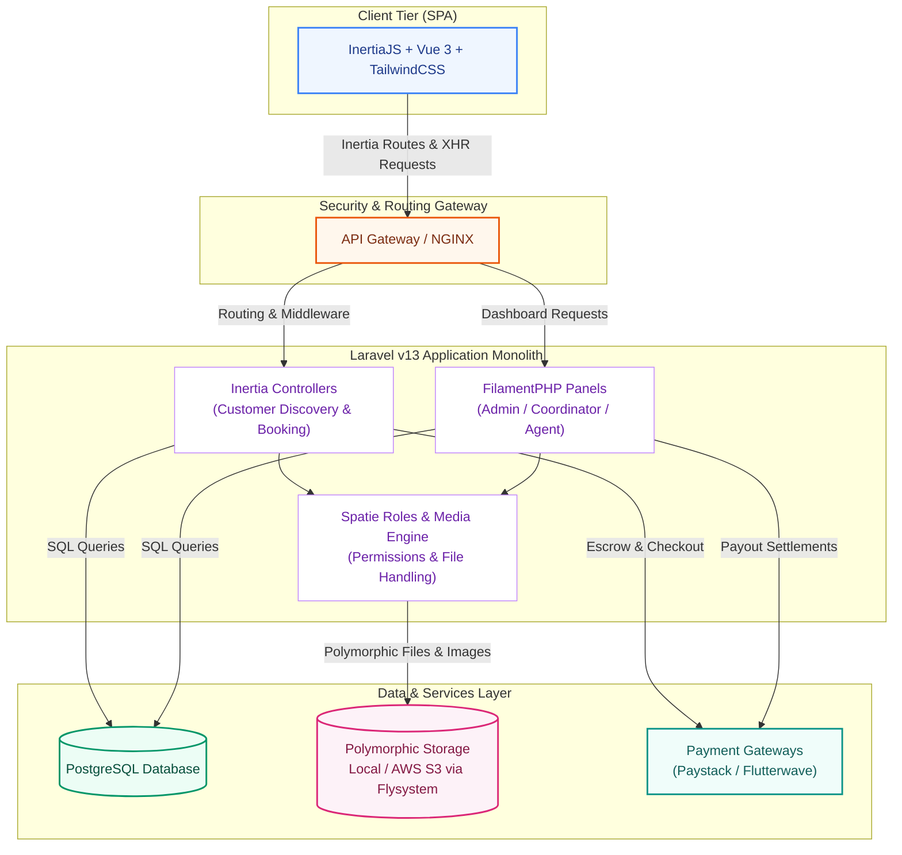
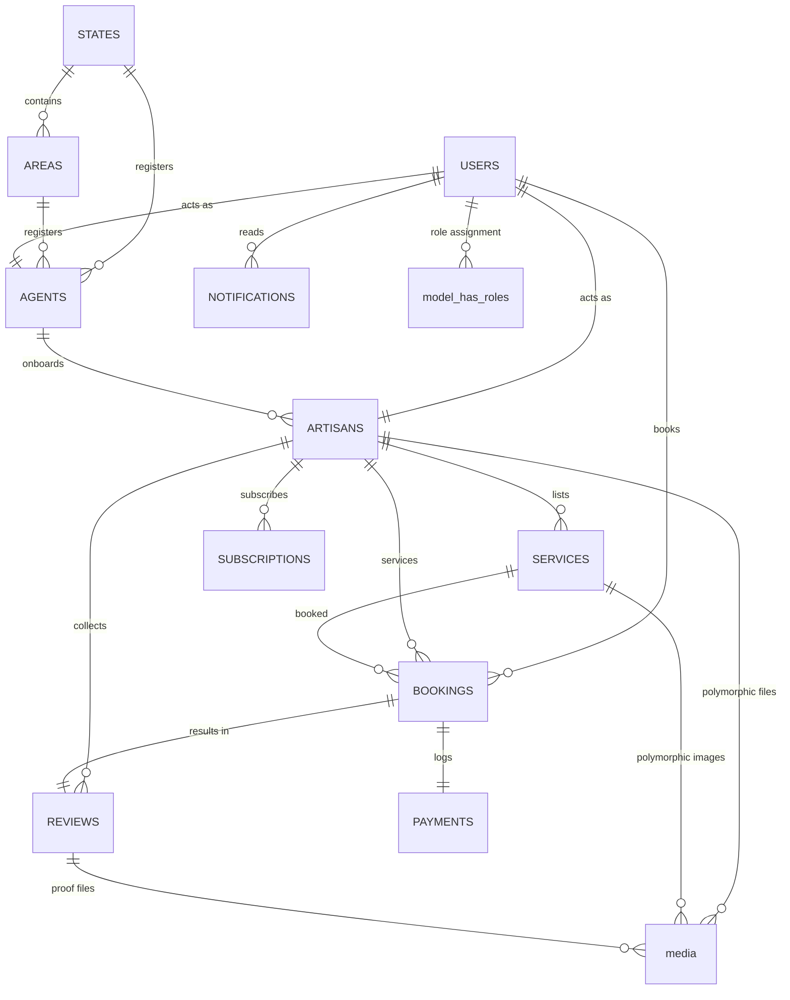
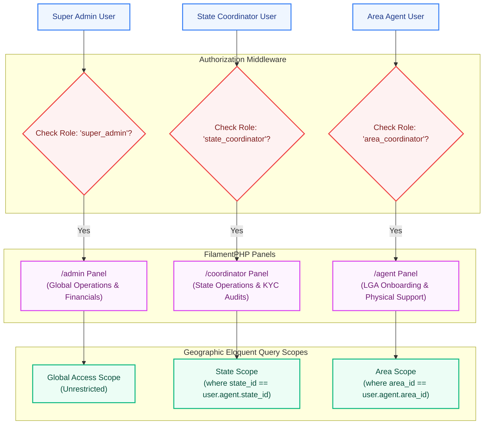
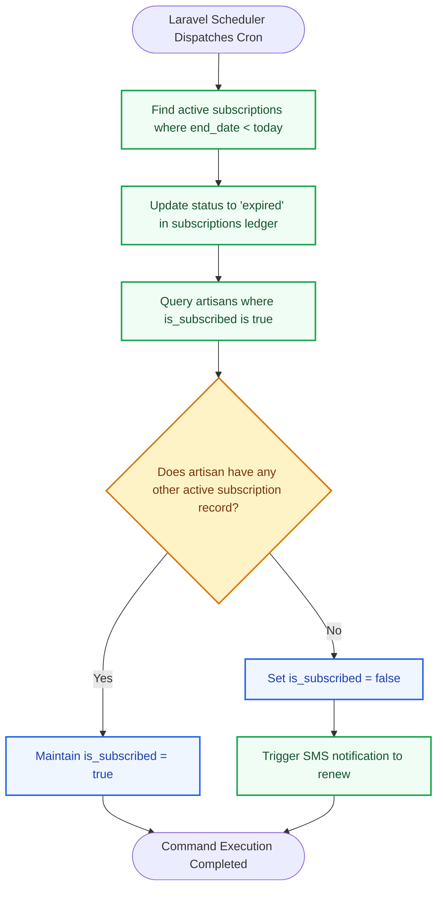
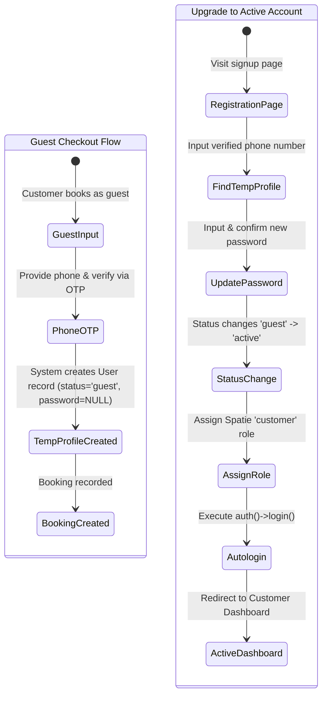

# Technical Specification Document
## Project: Lartisan App
### *Laravel v13 Monolith, Spatie Permissions, Spatie Media Library, Dedicated Agents Schema, and FilamentPHP Panel Architecture*

---

## 1. System Architecture

Lartisan App is engineered as a unified **Laravel v13 monolith**. It integrates customer-facing interactive views (InertiaJS) and back-office management interfaces (FilamentPHP) into a single, high-performance repository.



### 1.1 Project Directory Structure (Standard Laravel Layout)
```
lartisan-monolith/
├── app/
│   ├── Console/Commands/       # Scheduled Cron Jobs (e.g. Subscriptions)
│   ├── Filament/               # FilamentPHP Panel Architectures
│   │   ├── Pages/              # Custom Filament Dashboards
│   │   └── Resources/          # User, Agent, Artisan, Booking Resources
│   ├── Http/
│   │   ├── Controllers/        # Inertia Controllers (Customer / Discovery)
│   │   └── Middleware/         # Spatie and Geo-Scoping Permissions Middleware
│   └── Models/                 # Eloquent Models (User, Agent, Artisan, etc.)
├── database/
│   ├── migrations/             # Database DDL Migrations
│   └── seeders/                # Default States, Areas, and Roles seeders
├── resources/
│   ├── js/
│   │   ├── Pages/              # Vue 3 SPA Pages (Home, Booking, Discovery)
│   │   └── app.js              # Inertia bootstrapper
│   └── css/
│       └── app.css             # TailwindCSS Stylesheet
└── routes/
    ├── web.php                 # Customer, Webhook, and Guest routes
    └── console.php             # Laravel Scheduler definitions
```

---

## 2. Refined Database Schema (PostgreSQL)

This schema fully integrates standard Spatie tables alongside custom business tables. Polymorphic relations (from Spatie Media Library) replace historical custom media and document arrays.

```sql
-- Standard PostgreSQL Extensions
CREATE EXTENSION IF NOT EXISTS "uuid-ossp";

-- 1. States Reference Table
CREATE TABLE states (
    id SERIAL PRIMARY KEY,
    name VARCHAR(100) NOT NULL UNIQUE,
    created_at TIMESTAMP WITH TIME ZONE DEFAULT CURRENT_TIMESTAMP,
    updated_at TIMESTAMP WITH TIME ZONE DEFAULT CURRENT_TIMESTAMP
);

-- 2. Areas (LGAs) Table
CREATE TABLE areas (
    id SERIAL PRIMARY KEY,
    state_id INT NOT NULL REFERENCES states(id) ON DELETE CASCADE,
    name VARCHAR(100) NOT NULL,
    created_at TIMESTAMP WITH TIME ZONE DEFAULT CURRENT_TIMESTAMP,
    updated_at TIMESTAMP WITH TIME ZONE DEFAULT CURRENT_TIMESTAMP,
    UNIQUE(state_id, name)
);

-- 3. Users Table (Core Auth Table for Spatie Models)
CREATE TABLE users (
    id SERIAL PRIMARY KEY,
    name VARCHAR(255) NOT NULL,
    phone VARCHAR(20) NOT NULL UNIQUE,
    email VARCHAR(255) UNIQUE,
    email_verified_at TIMESTAMP WITH TIME ZONE,
    password VARCHAR(255), -- Nullable for background guest profiles
    remember_token VARCHAR(100),
    status VARCHAR(50) NOT NULL DEFAULT 'active', -- active, inactive, guest
    created_at TIMESTAMP WITH TIME ZONE DEFAULT CURRENT_TIMESTAMP,
    updated_at TIMESTAMP WITH TIME ZONE DEFAULT CURRENT_TIMESTAMP
);

CREATE INDEX idx_users_phone ON users(phone);

-- 4. Dedicated Agents Table (One-to-One with Users)
CREATE TABLE agents (
    id SERIAL PRIMARY KEY,
    user_id INT NOT NULL UNIQUE REFERENCES users(id) ON DELETE CASCADE,
    agent_code VARCHAR(50) NOT NULL UNIQUE,
    state_id INT NOT NULL REFERENCES states(id) ON DELETE RESTRICT,
    area_id INT NOT NULL REFERENCES areas(id) ON DELETE RESTRICT,
    status VARCHAR(50) NOT NULL DEFAULT 'active', -- active, suspended
    created_at TIMESTAMP WITH TIME ZONE DEFAULT CURRENT_TIMESTAMP,
    updated_at TIMESTAMP WITH TIME ZONE DEFAULT CURRENT_TIMESTAMP
);

CREATE INDEX idx_agents_code ON agents(agent_code);

-- 5. Artisans Table
CREATE TABLE artisans (
    id SERIAL PRIMARY KEY,
    user_id INT NOT NULL UNIQUE REFERENCES users(id) ON DELETE CASCADE,
    business_name VARCHAR(255) NOT NULL,
    kyc_status VARCHAR(50) NOT NULL DEFAULT 'pending', -- pending, approved, rejected
    kyc_notes TEXT,
    is_subscribed BOOLEAN NOT NULL DEFAULT FALSE, -- Fast query cache flag
    onboarded_by_agent_id INT REFERENCES agents(id) ON DELETE SET NULL, -- Audits field agent conversions
    created_at TIMESTAMP WITH TIME ZONE DEFAULT CURRENT_TIMESTAMP,
    updated_at TIMESTAMP WITH TIME ZONE DEFAULT CURRENT_TIMESTAMP
);

-- 6. Services Catalog Table (Catalog Images handled by media table)
CREATE TABLE services (
    id SERIAL PRIMARY KEY,
    artisan_id INT NOT NULL REFERENCES artisans(id) ON DELETE CASCADE,
    title VARCHAR(255) NOT NULL,
    description TEXT,
    price DECIMAL(12, 2) NOT NULL CHECK (price >= 0),
    category VARCHAR(100) NOT NULL,
    status VARCHAR(50) NOT NULL DEFAULT 'active', -- active, inactive
    created_at TIMESTAMP WITH TIME ZONE DEFAULT CURRENT_TIMESTAMP,
    updated_at TIMESTAMP WITH TIME ZONE DEFAULT CURRENT_TIMESTAMP
);

-- 7. Bookings Table (Guest & Registered Compatible)
CREATE TABLE bookings (
    id SERIAL PRIMARY KEY,
    customer_id INT REFERENCES users(id) ON DELETE SET NULL, -- Soft reference to customer user record
    artisan_id INT NOT NULL REFERENCES artisans(id) ON DELETE CASCADE,
    service_id INT NOT NULL REFERENCES services(id) ON DELETE RESTRICT,
    status VARCHAR(50) NOT NULL DEFAULT 'pending', -- pending, accepted, in_progress, completed, cancelled
    scheduled_time TIMESTAMP WITH TIME ZONE NOT NULL,
    price DECIMAL(12, 2) NOT NULL CHECK (price >= 0),
    payment_status VARCHAR(50) NOT NULL DEFAULT 'pending', -- pending, paid, refunded
    guest_phone VARCHAR(20),
    guest_name VARCHAR(255),
    booking_address TEXT NOT NULL,
    booking_state_id INT NOT NULL REFERENCES states(id),
    booking_area_id INT NOT NULL REFERENCES areas(id),
    created_at TIMESTAMP WITH TIME ZONE DEFAULT CURRENT_TIMESTAMP,
    updated_at TIMESTAMP WITH TIME ZONE DEFAULT CURRENT_TIMESTAMP
);

-- 8. Payments Log Table
CREATE TABLE payments (
    id SERIAL PRIMARY KEY,
    booking_id INT NOT NULL REFERENCES bookings(id) ON DELETE RESTRICT,
    amount DECIMAL(12, 2) NOT NULL,
    commission_amount DECIMAL(12, 2) NOT NULL,
    artisan_amount DECIMAL(12, 2) NOT NULL,
    status VARCHAR(50) NOT NULL DEFAULT 'pending', -- pending, success, failed, refunded
    payment_ref VARCHAR(100) UNIQUE NOT NULL,
    payment_gateway VARCHAR(50) NOT NULL DEFAULT 'paystack',
    created_at TIMESTAMP WITH TIME ZONE DEFAULT CURRENT_TIMESTAMP,
    updated_at TIMESTAMP WITH TIME ZONE DEFAULT CURRENT_TIMESTAMP
);

-- 9. Reviews & Trust Score Table (Physical Proof Photos handled by media table)
CREATE TABLE reviews (
    id SERIAL PRIMARY KEY,
    booking_id INT NOT NULL UNIQUE REFERENCES bookings(id) ON DELETE CASCADE,
    customer_id INT NOT NULL REFERENCES users(id) ON DELETE CASCADE,
    artisan_id INT NOT NULL REFERENCES artisans(id) ON DELETE CASCADE,
    rating INT NOT NULL CHECK (rating >= 1 AND rating <= 5),
    comment TEXT,
    created_at TIMESTAMP WITH TIME ZONE DEFAULT CURRENT_TIMESTAMP,
    updated_at TIMESTAMP WITH TIME ZONE DEFAULT CURRENT_TIMESTAMP
);

-- 10. Subscriptions Ledger Table
CREATE TABLE subscriptions (
    id SERIAL PRIMARY KEY,
    artisan_id INT NOT NULL REFERENCES artisans(id) ON DELETE CASCADE,
    plan VARCHAR(50) NOT NULL, -- basic, pro, premium
    amount DECIMAL(10, 2) NOT NULL,
    start_date DATE NOT NULL,
    end_date DATE NOT NULL,
    status VARCHAR(50) NOT NULL DEFAULT 'active', -- active, expired, cancelled
    payment_ref VARCHAR(100) UNIQUE NOT NULL,
    created_at TIMESTAMP WITH TIME ZONE DEFAULT CURRENT_TIMESTAMP,
    updated_at TIMESTAMP WITH TIME ZONE DEFAULT CURRENT_TIMESTAMP
);

-- 11. System Notifications Queue Table
CREATE TABLE notifications (
    id SERIAL PRIMARY KEY,
    user_id INT NOT NULL REFERENCES users(id) ON DELETE CASCADE,
    type VARCHAR(50) NOT NULL DEFAULT 'sms', -- sms, email, push, whatsapp
    message TEXT NOT NULL,
    is_read BOOLEAN NOT NULL DEFAULT FALSE,
    deep_link VARCHAR(255),
    created_at TIMESTAMP WITH TIME ZONE DEFAULT CURRENT_TIMESTAMP,
    updated_at TIMESTAMP WITH TIME ZONE DEFAULT CURRENT_TIMESTAMP
);

-- 12. Spatie laravel-permission Schema Setup
CREATE TABLE roles (
    id SERIAL PRIMARY KEY,
    name VARCHAR(255) NOT NULL,
    guard_name VARCHAR(255) NOT NULL,
    created_at TIMESTAMP WITH TIME ZONE DEFAULT CURRENT_TIMESTAMP,
    updated_at TIMESTAMP WITH TIME ZONE DEFAULT CURRENT_TIMESTAMP,
    UNIQUE(name, guard_name)
);

CREATE TABLE permissions (
    id SERIAL PRIMARY KEY,
    name VARCHAR(255) NOT NULL,
    guard_name VARCHAR(255) NOT NULL,
    created_at TIMESTAMP WITH TIME ZONE DEFAULT CURRENT_TIMESTAMP,
    updated_at TIMESTAMP WITH TIME ZONE DEFAULT CURRENT_TIMESTAMP,
    UNIQUE(name, guard_name)
);

CREATE TABLE model_has_roles (
    role_id INT NOT NULL REFERENCES roles(id) ON DELETE CASCADE,
    model_type VARCHAR(255) NOT NULL,
    model_id INT NOT NULL,
    PRIMARY KEY(role_id, model_id, model_type)
);

CREATE TABLE model_has_permissions (
    permission_id INT NOT NULL REFERENCES permissions(id) ON DELETE CASCADE,
    model_type VARCHAR(255) NOT NULL,
    model_id INT NOT NULL,
    PRIMARY KEY(permission_id, model_id, model_type)
);

CREATE TABLE role_has_permissions (
    permission_id INT NOT NULL REFERENCES permissions(id) ON DELETE CASCADE,
    role_id INT NOT NULL REFERENCES roles(id) ON DELETE CASCADE,
    PRIMARY KEY(permission_id, role_id)
);

-- 13. Spatie laravel-medialibrary Table
CREATE TABLE media (
    id SERIAL PRIMARY KEY,
    model_type VARCHAR(255) NOT NULL,
    model_id INT NOT NULL,
    uuid UUID DEFAULT uuid_generate_v4() UNIQUE,
    collection_name VARCHAR(255) NOT NULL,
    name VARCHAR(255) NOT NULL,
    file_name VARCHAR(255) NOT NULL,
    mime_type VARCHAR(255),
    disk VARCHAR(255) NOT NULL,
    conversions_disk VARCHAR(255),
    size INT NOT NULL CHECK(size > 0),
    manipulations JSONB NOT NULL DEFAULT '{}',
    custom_properties JSONB NOT NULL DEFAULT '{}',
    generated_conversions JSONB NOT NULL DEFAULT '{}',
    responsive_images JSONB NOT NULL DEFAULT '{}',
    order_column INT CHECK(order_column >= 0),
    created_at TIMESTAMP WITH TIME ZONE DEFAULT CURRENT_TIMESTAMP,
    updated_at TIMESTAMP WITH TIME ZONE DEFAULT CURRENT_TIMESTAMP
);

CREATE INDEX media_model_type_model_id_index ON media(model_type, model_id);
```

---

## 3. Database Relationships (Mermaid ERD)



---

## 4. Web & Dashboard Routing Specification

All application routes are defined inside the unified monolithic routing structure of Laravel.

### 4.1 Inertia Customer Front-End Routes (`routes/web.php`)
These routes yield SPA client views by passing compiled data payloads straight to Vue 3 files via Inertia.

| HTTP Method | Route URL | Controller Action | Description |
| :--- | :--- | :--- | :--- |
| **GET** | `/` | `HomeController@index` | Render client landing page with search widgets. |
| **GET** | `/services` | `ServiceController@index` | Render dynamic service results matching category/proximity tags. |
| **GET** | `/artisans/{id}` | `ArtisanController@show` | Render selected artisan profile with public reviews. |
| **POST** | `/bookings` | `BookingController@store` | Places a service request. Spawns guest profile if unauthorized. |
| **POST** | `/bookings/{id}/pay` | `PaymentController@charge` | Verification endpoints for cards/transfers via Flutterwave or Paystack. |
| **GET** | `/my-bookings` | `BookingController@index` | Customer profile tracking. Accessible only via auth. |

### 4.2 FilamentPHP Admin Panels
Dashboards and coordinator queues are designed using isolated **Filament Panels**. Access boundaries are strictly protected by role-checking middlewares.



```php
// app/Providers/Filament/AdminPanelProvider.php
// Registers distinct panels: /admin, /coordinator, /agent
```

* **`/admin` (Super Admin Panel)**:
  - Global financial performance dashboard.
  - CRUD resources for managing system settings (`commission_rate`, `subscription_prices`).
  - Management resource for creating, assigning, or suspending `State Coordinators`.
* **`/coordinator` (State Coordinator Panel)**:
  - Localized dashboard showing charts scoped strictly to `auth()->user()->agent->state_id`.
  - Approve pending KYC requests for local artisans.
  - Coordinate the deployment of regional field managers (`agents`).
* **`/agent` (Area Agent Panel)**:
  - Unified field dashboard scoped strictly to `auth()->user()->agent->area_id` (their LGA).
  - Quick action button: "Register Artisan" (launches a specialized Wizard form).
  - Artisan Relation Manager: Track active, pending, or suspended local workers.

### 4.3 Financial Webhooks
* **`POST /webhooks/paystack`**: Direct webhook endpoint mapping async payment callbacks (subscriptions, settlements, and transfers) to prevent client-side payment completion bypasses.

---

## 5. Role-Based Access Control & Data Scoping Rules

We apply Eloquent **Global Query Scopes** to isolate coordinator and agent workspaces automatically depending on their geographic assignments.

### 5.1 Scoping Eloquent Models (Example implementation)
```php
namespace App\Models;

use Illuminate\Database\Eloquent\Model;
use Illuminate\Database\Eloquent\Builder;

class Artisan extends Model
{
    protected static function booted()
    {
        static::addGlobalScope('coordinator-scope', function (Builder $builder) {
            $user = auth()->user();
            if (!$user) return;

            // If user has the 'state_coordinator' role, scope their query to state
            if ($user->hasRole('state_coordinator') && $user->agent) {
                $builder->whereHas('user', function ($q) use ($user) {
                    $q->where('state_id', $user->agent->state_id);
                });
            }

            // If user has the 'area_coordinator' (Area Agent) role, scope to LGA
            if ($user->hasRole('area_coordinator') && $user->agent) {
                $builder->whereHas('user', function ($q) use ($user) {
                    $q->where('area_id', $user->agent->area_id);
                });
            }
        });
    }
}
```

---

## 6. Core Laravel Code Blocks

### 6.1 Spatie Media Upload Controller Action
Demonstrates the ease of integrating files with Spatie Media Library under dynamic catalog routes:

```php
namespace App\Http\Controllers;

use App\Models\Service;
use Illuminate\Http\Request;

class ServiceController extends Controller
{
    public function store(Request $request)
    {
        $validated = $request->validate([
            'title' => 'required|string|max:255',
            'price' => 'required|numeric|min:0',
            'category' => 'required|string',
            'images.*' => 'image|mimes:jpeg,png,jpg|max:4096' // Validation limits
        ]);

        $service = auth()->user()->artisan->services()->create($validated);

        // Standard Spatie polymorphic file upload mapping
        if ($request->hasFile('images')) {
            foreach ($request->file('images') as $image) {
                $service->addMedia($image)
                        ->toMediaCollection('service_images');
            }
        }

        return redirect()->route('artisan.services.index');
    }
}
```

### 6.2 Subscription Expiry Artisan Console Command
* **Implementation Path**: `app/Console/Commands/CheckExpiredSubscriptions.php`
* **Execution**: Dispatched automatically by the Laravel Task Scheduler.



```php
namespace App\Console\Commands;

use Illuminate\Console\Command;
use App\Models\Subscription;
use App\Models\Artisan;

class CheckExpiredSubscriptions extends Command
{
    protected $signature = 'lartisan:check-subscriptions';
    protected $description = 'Checks active subscriptions for expiry dates and deactivates profile cache';

    public function handle()
    {
        // 1. Expire outdated records in ledger
        Subscription::where('status', 'active')
            ->where('end_date', '<', now()->toDateString())
            ->update(['status' => 'expired']);

        // 2. Set cache flags off for artisans without any active subscription records
        Artisan::where('is_subscribed', true)
            ->whereNotExists(function ($query) {
                $query->selectRaw(1)
                      ->from('subscriptions')
                      ->whereColumn('subscriptions.artisan_id', 'artisans.id')
                      ->where('subscriptions.status', 'active')
                      ->where('subscriptions.end_date', '>=', now()->toDateString());
            })
            ->update(['is_subscribed' => false]);

        $this->info('Active subscription caches evaluated successfully.');
    }
}
```

### 6.3 Guest Account Upgrade & Ledger Consolidation
When a guest registers, the database updates the temp profile rather than creating a new record:



```php
namespace App\Http\Controllers;

use App\Models\User;
use Illuminate\Http\Request;
use Illuminate\Support5\Facades\Hash;

class AuthController extends Controller
{
    public function upgradeGuest(Request $request)
    {
        $request->validate([
            'phone' => 'required|string',
            'password' => 'required|string|min:8|confirmed'
        ]);

        // Find the temporary profile created during the guest checkout flow
        $user = User::where('phone', $request->phone)
                    ->where('status', 'guest')
                    ->firstOrFail();

        // Standard Laravel migration and transition
        $user->update([
            'password' => Hash::make($request->password),
            'status' => 'active'
        ]);

        // Automatically assign customer role using Spatie permission interface
        $user->assignRole('customer');

        auth()->login($user);

        return redirect()->route('dashboard');
    }
}
```
