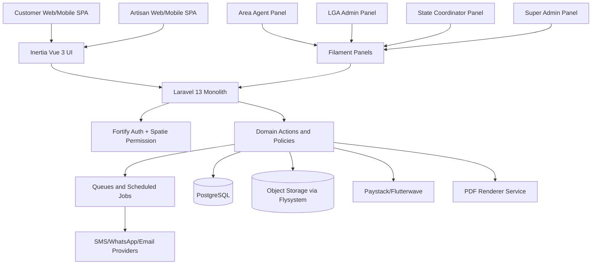
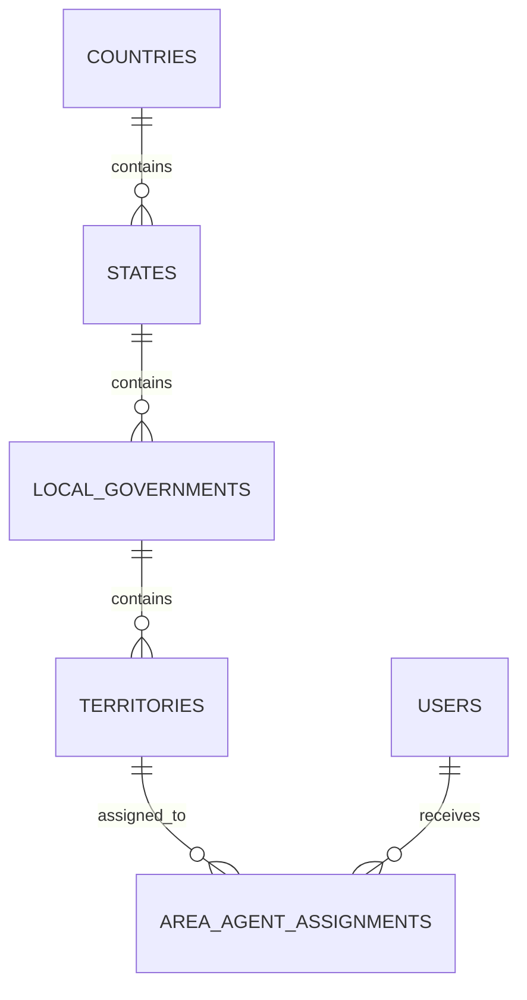

# Lartisan App Technical Specification

Version: 3.1 implementation blueprint
Date: 30 May 2026
Source: `docs/lartisan_brs.md`
Status: Build-ready product and engineering specification; implementation notes current through Phase 6

## 1. Executive Technical Summary

Lartisan is a Laravel 13 monolith for a premium local-service marketplace in Nigeria. The platform connects customers with verified artisans while giving operations teams a field-aware hierarchy for onboarding, verification, support, disputes, reporting, subscriptions, wallet settlement, and payouts.

The BRS changed the operating hierarchy from State Coordinator -> Area Agent to State Coordinator -> Local Government Admin -> Area Agent. This spec uses that revised model throughout the database, authorization, dashboard, verification, reporting, and escalation design.

### 1.1 Primary System Goals

- Let customers discover, book, pay, confirm, and review verified artisans.
- Let artisans manage profiles, services, availability, KYC, subscriptions, bookings, wallet, and payouts.
- Let Area Agents register and verify artisans inside wards, communities, markets, estates, and service clusters.
- Let LGA Admins own day-to-day local operations for one Local Government Area.
- Let State Coordinators supervise LGAs, escalations, state campaigns, and state reporting.
- Let Super Admins govern platform policy, finance, roles, risk, and global configuration.

### 1.2 Architectural Decisions

| Decision          | Direction                                                                                                          |
| ----------------- | ------------------------------------------------------------------------------------------------------------------ |
| Application shape | Laravel 13 monolith with Inertia Vue for product UI and Filament for operational panels.                           |
| Database          | PostgreSQL in production; SQLite remains acceptable for local tests.                                               |
| Authorization     | Spatie Permission recommended for database-backed roles and permission templates.                                  |
| Media             | Spatie Media Library recommended for KYC, portfolio, proof-of-work, and dispute evidence.                          |
| PDFs              | Spatie Laravel PDF recommended for receipts, payout statements, verification reports, invoices, and dispute packs. |
| Payments          | Provider abstraction over Paystack and Flutterwave.                                                                |
| Notifications     | Laravel Notifications with SMS, WhatsApp, email, and optional push channels.                                       |
| Frontend routes   | Wayfinder-generated route/action helpers for Inertia links and forms.                                              |
| Testing           | Pest for feature, unit, policy, route, notification, validation, and coverage gates.                               |

## 2. System Architecture



### 2.1 Application Layers

| Layer              | Responsibility                                                                                          |
| ------------------ | ------------------------------------------------------------------------------------------------------- |
| Routes             | Web, guest booking, authenticated product UI, admin panels, provider webhooks.                          |
| Controllers        | Thin Inertia endpoints and webhook entrypoints. Delegate business work to actions.                      |
| Form Requests      | Validation, authorization, and normalization for writes.                                                |
| Actions            | Single-purpose workflow steps such as create booking, approve KYC, settle wallet, or request payout.    |
| Models             | Eloquent relationships, casts, scopes, and domain status helpers.                                       |
| Policies           | Per-model access rules with geographic scoping.                                                         |
| Notifications      | Transactional notifications and provider-specific delivery.                                             |
| Jobs               | Payment verification, notification delivery, media processing, reports, PDF generation, payout retries. |
| Filament Resources | CRUD, review queues, operations dashboards, scoped reports, and admin workflows.                        |

## 3. Package Strategy

No third-party packages are installed by this spec. The following packages are recommended for implementation approval.

| Package                                             | Purpose                                                           | Notes                                                                                                                            |
| --------------------------------------------------- | ----------------------------------------------------------------- | -------------------------------------------------------------------------------------------------------------------------------- |
| `spatie/laravel-permission`                         | Roles and permissions                                             | Use permissions for policy decisions. Roles map to Super Admin, State Coordinator, LGA Admin, Area Agent, Artisan, and Customer. |
| `spatie/laravel-medialibrary`                       | KYC, portfolio, proof, and dispute media                          | Define named collections per model and store files on private disks where identity or dispute data is sensitive.                 |
| `spatie/laravel-pdf`                                | Receipts, payout statements, KYC reports, invoices, dispute packs | Default to Browsershot for MVP. Wrap behind `DocumentRenderer` so Gotenberg or Cloudflare can replace it later.                  |
| Filament                                            | Admin dashboards and resources                                    | Use separate panels or navigation groups by operational role.                                                                    |
| Paystack/Flutterwave SDK or first-party HTTP client | Payments and payouts                                              | Prefer a local provider interface over leaking provider SDK objects into controllers.                                            |

## 4. Role And Permission Model

### 4.1 Roles

| Role                   | Scope                                       | Primary UI                         | Core responsibilities                                                                                      |
| ---------------------- | ------------------------------------------- | ---------------------------------- | ---------------------------------------------------------------------------------------------------------- |
| Super Admin            | Platform-wide                               | Super admin panel                  | Global settings, finance oversight, provider configuration, role templates, state accounts, risk, reports. |
| State Coordinator      | One state                                   | State panel                        | LGA Admin supervision, escalated KYC, state disputes, campaigns, state metrics.                            |
| Local Government Admin | One LGA                                     | LGA panel                          | Area Agent assignment, local KYC queues, field operations, local support, local disputes, LGA reports.     |
| Area Agent             | One or more local territories inside an LGA | Agent panel or responsive field UI | Assisted onboarding, visits, evidence capture, first-line support, local flags.                            |
| Artisan                | Own business profile                        | Artisan workspace                  | KYC, service catalog, availability, bookings, subscriptions, wallet, payout details.                       |
| Registered Customer    | Own profile and bookings                    | Customer SPA                       | Saved addresses, booking history, chat, payments, reviews.                                                 |
| Guest Customer         | One booking context                         | Customer SPA and secure links      | OTP booking, status tracking, payment, receipt, limited communication.                                     |

### 4.2 Permission Families

| Family            | Examples                                                                    |
| ----------------- | --------------------------------------------------------------------------- |
| Platform settings | Manage categories, plans, commission, role templates, risk settings.        |
| Admin management  | Create state coordinators, manage LGA admins, manage area agents.           |
| Territory         | Create states/LGAs/areas, assign territories, reassign with reason.         |
| KYC               | Submit field check, review standard KYC, escalate KYC, suspend profile.     |
| Bookings          | View scoped bookings, manage status exceptions, resolve failed flows.       |
| Finance           | View payments, manage payout queue, approve adjustments, export statements. |
| Support           | View cases, add notes, escalate disputes, close local cases.                |
| Reporting         | View dashboards and exports within global, state, LGA, area, or own scope.  |

### 4.3 Data Scoping

Policies and query scopes must enforce geography and ownership.

| Actor             | Default data visibility                                                            |
| ----------------- | ---------------------------------------------------------------------------------- |
| Super Admin       | All states, LGAs, areas, artisans, bookings, payments, payouts, disputes.          |
| State Coordinator | Records assigned to the coordinator's state.                                       |
| LGA Admin         | Records assigned to the admin's LGA.                                               |
| Area Agent        | Artisans, visits, support tasks, and disputes assigned to the agent's territories. |
| Artisan           | Own profile, services, bookings, wallet, subscription, reviews, payouts.           |
| Customer          | Own bookings, addresses, payment records, reviews, chat contexts.                  |

## 5. Territory Model

The platform must represent actual field operations, not just abstract locations.



### 5.1 Geographic Entities

| Entity           | Purpose                                                    | Key fields                                                      |
| ---------------- | ---------------------------------------------------------- | --------------------------------------------------------------- |
| Country          | Launch country; initially Nigeria.                         | name, iso_code, currency_code, phone_country_code.              |
| State            | State-level administration and reporting.                  | country_id, name, slug, active.                                 |
| Local Government | LGA-level operations and dashboards.                       | state_id, name, slug, active.                                   |
| Territory        | Ward, community, market, estate, cluster, or service zone. | local_government_id, type, name, boundaries, active.            |
| Assignment       | Connects Area Agents to territories.                       | user_id, territory_id, starts_at, ends_at, assigned_by, reason. |

### 5.2 Territory Rules

- Every listed artisan must resolve to a state and LGA.
- Area Agents must be assigned to at least one active territory.
- LGA Admins may manage only their assigned LGA unless a State Coordinator grants temporary access.
- Reassignments require actor, timestamp, previous scope, new scope, and reason.
- Bookings should store the resolved state, LGA, and territory snapshot at creation time for reporting stability.

## 6. Domain Data Model

This section defines the target model set. Exact migrations should be generated incrementally.

### 6.1 Identity And Organization

| Model           | Key fields                                                                                                   | Relationships                                                                      |
| --------------- | ------------------------------------------------------------------------------------------------------------ | ---------------------------------------------------------------------------------- |
| User            | name, email, phone, password, status, current_team_id, preferred_channel                                     | has roles, has one artisan profile, has many bookings, has many admin assignments. |
| AdminProfile    | user_id, role_scope_type, role_scope_id, status, appointed_by                                                | belongs to user; scope is platform, state, LGA, or territory.                      |
| ArtisanProfile  | user_id, business_name, verification_status, subscription_status, availability_status, onboarded_by_agent_id | belongs to user, categories, services, KYC submissions, wallet.                    |
| CustomerProfile | user_id, default_address_id, preferences                                                                     | belongs to user, has addresses and bookings.                                       |

### 6.2 Marketplace

| Model           | Key fields                                                                                            | Relationships                                       |
| --------------- | ----------------------------------------------------------------------------------------------------- | --------------------------------------------------- |
| ServiceCategory | parent_id, name, slug, icon, active, sort_order                                                       | has many services.                                  |
| ArtisanService  | artisan_id, category_id, title, description, starting_price, status                                   | belongs to artisan and category; has media.         |
| Address         | user_id, label, contact_name, phone, state_id, local_government_id, territory_id, line_1, coordinates | belongs to user and geography.                      |
| Booking         | customer_id, artisan_id, service_id, status, scheduled_at, quoted_amount, address snapshot, source    | has payment, chat, review, dispute, status history. |
| Review          | booking_id, customer_id, artisan_id, rating, comment, status                                          | may have proof media and moderation notes.          |

### 6.3 Verification And Field Operations

| Model         | Key fields                                                                                 | Relationships                                           |
| ------------- | ------------------------------------------------------------------------------------------ | ------------------------------------------------------- |
| KycSubmission | artisan_id, status, risk_level, submitted_at, reviewed_by, reviewed_at, decision_reason    | has media, visit checks, status history.                |
| FieldVisit    | artisan_id, area_agent_id, territory_id, status, visited_at, coordinates, notes, checklist | belongs to KYC submission where applicable.             |
| SupportCase   | subject, category, priority, status, owner_id, scope fields                                | may link booking, artisan, payment, payout, or dispute. |
| Dispute       | booking_id, opened_by, status, severity, owner_role, resolution                            | has evidence media and timeline.                        |
| AuditLog      | actor_id, action, subject_type, subject_id, before, after, reason, ip_address              | append-only.                                            |

### 6.4 Finance

| Model             | Key fields                                                                                     | Relationships                                |
| ----------------- | ---------------------------------------------------------------------------------------------- | -------------------------------------------- |
| Payment           | booking_id, provider, provider_reference, amount, fees, status, paid_at                        | belongs to booking; has webhook events.      |
| Wallet            | artisan_id, currency, available_balance, pending_balance                                       | has ledger entries.                          |
| WalletLedgerEntry | wallet_id, type, amount, direction, balance_after, source_type, source_id, immutable_reference | append-only.                                 |
| PayoutAccount     | artisan_id, bank_code, account_number_hash, account_name, verification_status                  | stores sensitive fields securely.            |
| Payout            | wallet_id, provider, amount, status, approved_by, processed_at, failure_reason                 | has retry attempts.                          |
| SubscriptionPlan  | name, price, duration_days, benefits, visibility_weight, active                                | configured by Super Admin.                   |
| Subscription      | artisan_id, plan_id, status, starts_at, ends_at, grace_ends_at, payment_id                     | controls listing visibility and lead access. |

## 7. Status Values

| Object               | Statuses                                                                                                                |
| -------------------- | ----------------------------------------------------------------------------------------------------------------------- |
| User                 | Active, Inactive, Suspended, Guest, PendingClaim.                                                                       |
| Artisan verification | Draft, Submitted, FieldCheckPending, FieldCheckComplete, LgaReview, Approved, Returned, Rejected, Escalated, Suspended. |
| Field visit          | Scheduled, InProgress, Completed, Failed, NeedsRevisit, Cancelled.                                                      |
| Service              | Draft, Active, Hidden, Suspended, Archived.                                                                             |
| Availability         | Online, Busy, Offline, Vacation.                                                                                        |
| Booking              | Requested, Accepted, Rejected, InProgress, Finished, Confirmed, Cancelled. Paid, Disputed, Settled, and Reviewed are later lifecycle extensions. |
| Payment              | Pending, Processing, Successful, Failed, Refunded, PartiallyRefunded, Reversed.                                         |
| Wallet ledger        | BookingCredit, CommissionDebit, FeeDebit, PayoutDebit, RefundDebit, AdjustmentCredit, AdjustmentDebit.                  |
| Payout               | Pending, InReview, Approved, Processing, Paid, Failed, Retrying, Cancelled, Adjusted.                                   |
| Subscription         | Trial, Active, GracePeriod, Expired, Cancelled, Suspended.                                                              |
| Dispute              | Open, AwaitingEvidence, UnderLgaReview, EscalatedToState, Resolved, Reopened, Closed.                                   |

Use PHP backed enums with TitleCase keys for statuses and role names.

## 8. Core Workflows

### 8.1 Artisan Self-Registration

1. Artisan signs up with phone OTP and optional email.
2. Artisan enters business profile, location, categories, service coverage, portfolio, and payout details.
3. Artisan uploads KYC media to private collections.
4. System maps profile to state, LGA, and territory.
5. KYC moves to FieldCheckPending if a visit is required.
6. LGA Admin reviews standard-risk submissions after field evidence is complete.
7. State Coordinator reviews escalated, duplicate, high-risk, or disputed submissions.
8. Approved artisan selects and pays for a subscription.
9. Listing becomes public only when verification and subscription are active.

### 8.2 Agent-Assisted Registration

1. Area Agent selects assigned territory.
2. Agent captures artisan identity, shop details, coordinates, photos, KYC documents, and visit checklist.
3. System marks `onboarded_by_agent_id`.
4. Artisan receives OTP or account-claim link.
5. LGA Admin reviews the submission.
6. Artisan claims the account before managing bookings or payouts.

### 8.3 Booking And Payment

Phase 6 currently implements marketplace discovery, guest and registered booking requests, secure tracker links, customer confirmation, artisan booking lifecycle actions, booking status history, and wallet release after confirmed quoted work. OTP-at-booking, booking checkout/escrow, transactional notifications, chat, disputes, and verified reviews remain later phases.

1. Customer selects category, location, schedule, description, and optional images.
2. Guest customers verify phone by OTP; registered customers may reuse saved addresses.
3. System ranks verified, active, subscribed artisans by location, availability, category, rating, response rate, and subscription benefits.
4. Artisan accepts or rejects within a configured window.
5. Customer pays through Paystack or Flutterwave.
6. Booking status and payment status update only from trusted provider verification or webhook events.
7. Customer confirms completion.
8. Wallet ledger records gross earning, commission, fees, and net pending settlement.
9. Review opens only after completed paid booking.

### 8.4 Dispute Flow

1. Customer, artisan, or operations user opens a dispute against a booking, review, payment, or profile.
2. Evidence media is stored in dispute collections.
3. Area Agent may collect local evidence.
4. LGA Admin resolves standard local disputes.
5. State Coordinator handles severe, repeated, high-value, or policy-exception disputes.
6. Finance or Super Admin handles refund, adjustment, or payout exceptions.
7. Resolution writes audit logs and immutable ledger adjustments where money changes.

### 8.5 Payout Flow

1. Artisan submits payout account.
2. Account is verified by provider or manual review.
3. Available wallet balance is calculated from ledger entries.
4. Payout request is created manually or by schedule.
5. Payout enters review when risk, amount, failed history, or policy requires it.
6. Provider transfer is dispatched through a queued job.
7. Webhook or polling updates payout status.
8. Failed payouts create retry attempts and support tasks.

## 9. Public And Internal Interfaces

### 9.1 Customer Inertia Routes

| Method | Route                                                   | Purpose                                                          |
| ------ | ------------------------------------------------------- | ---------------------------------------------------------------- |
| GET    | `/`                                                     | Welcome entry point.                                             |
| GET    | `/marketplace`                                          | Search verified subscribed artisans by keyword, category, and geography. |
| GET    | `/marketplace/artisans/{artisanProfile}`                | Public artisan profile, services, location, availability, and portfolio. |
| GET    | `/marketplace/artisans/{artisanProfile}/book`           | Guest or registered booking request form.                        |
| POST   | `/marketplace/artisans/{artisanProfile}/bookings`       | Create guest or registered booking request.                      |
| GET    | `/booking-tracker/{trackerCode}?token=...`              | Secure single-booking tracker link.                              |
| POST   | `/booking-tracker/{trackerCode}/confirm`                | Confirm completion from the secure tracker.                      |
| GET    | `/customer/bookings`                                    | Registered customer booking list.                                |
| GET    | `/customer/bookings/{booking}`                          | Registered customer booking detail.                              |
| POST   | `/customer/bookings/{booking}/confirm`                  | Confirm completion from the signed-in customer surface.           |

Booking payment, review submission, saved-address selection, and guest account upgrade routes are intentionally outside the current Phase 6 route set.

### 9.2 Artisan Routes

Authenticated artisan routes are scoped under the current team prefix: `/{current_team}/artisan`.

| Method    | Route                              | Purpose                          |
| --------- | ---------------------------------- | -------------------------------- |
| GET       | `/artisan`                         | Artisan dashboard.               |
| GET/PATCH | `/artisan/profile`                 | Business profile.                |
| POST      | `/artisan/profile/portfolio`       | Public portfolio media upload.   |
| GET/POST  | `/artisan/kyc`                     | KYC submission and corrections.  |
| POST      | `/artisan/field-visits`            | Field visit evidence capture.    |
| GET/POST  | `/artisan/services`                | Catalog management.              |
| GET       | `/artisan/bookings`                | Artisan booking queue.           |
| POST      | `/artisan/bookings/{booking}/accept` | Accept requested booking.      |
| POST      | `/artisan/bookings/{booking}/reject` | Reject requested booking.      |
| POST      | `/artisan/bookings/{booking}/start` | Start accepted work.            |
| POST      | `/artisan/bookings/{booking}/finish` | Mark in-progress work finished. |
| GET       | `/artisan/wallet`                  | Ledger and payout history.       |
| GET/POST  | `/artisan/subscription`            | Plan selection and renewal.      |

### 9.3 Operational Panels

| Panel             | Route prefix | Main modules                                                                           |
| ----------------- | ------------ | -------------------------------------------------------------------------------------- |
| Super Admin       | `/admin`     | Settings, roles, states, LGAs, categories, plans, finance, risk, reports.              |
| State Coordinator | `/state`     | State dashboard, LGA admins, escalated KYC, disputes, state reporting.                 |
| LGA Admin         | `/lga`       | Area agents, local KYC queue, visits, disputes, support, LGA metrics.                  |
| Area Agent        | `/agent`     | Assigned territories, assisted registrations, visits, support tasks, evidence capture. |

### 9.4 Webhooks

| Method | Route                   | Source            | Rules                                                              |
| ------ | ----------------------- | ----------------- | ------------------------------------------------------------------ |
| POST   | `/webhooks/paystack`    | Paystack          | Verify signature, store raw event, idempotently process reference. |
| POST   | `/webhooks/flutterwave` | Flutterwave       | Verify signature, store raw event, idempotently process reference. |
| POST   | `/webhooks/whatsapp`    | WhatsApp provider | Verify signature, parse delivery and inbound messages.             |

Webhook handlers must be idempotent. Store provider event IDs and ignore duplicates after confirming the event was already processed.

## 10. Media Collections

Use private disks for sensitive identity, address, finance, and dispute media.

| Model          | Collection                                                                    | Visibility                                |
| -------------- | ----------------------------------------------------------------------------- | ----------------------------------------- |
| ArtisanProfile | `portfolio`                                                                   | Public after moderation.                  |
| KycSubmission  | `government_id`, `self_portrait`, `address_evidence`, `business_registration` | Private.                                  |
| FieldVisit     | `visit_photos`, `shop_photos`, `checklist_evidence`                           | Private operations.                       |
| Booking        | `booking_attachments`                                                         | Scoped to booking parties and operations; dedicated customer/artisan proof collections can be split later. |
| Dispute        | `evidence`                                                                    | Private operations and involved parties.  |
| Review         | `proof_of_work`                                                               | Public only after moderation rules pass.  |

## 11. PDF Documents

Create a `DocumentRenderer` service that wraps Spatie Laravel PDF.

| Document                 | Trigger                             | Storage                                |
| ------------------------ | ----------------------------------- | -------------------------------------- |
| Customer receipt         | Successful payment                  | Public signed URL or customer account. |
| Artisan payout statement | Paid payout or monthly export       | Private artisan account.               |
| Verification report      | KYC approval, rejection, escalation | Private operations.                    |
| Dispute pack             | Escalation or legal/support export  | Private operations.                    |
| Invoice                  | Subscription payment                | Artisan account and finance archive.   |

Default driver: Browsershot. Keep driver configuration centralized so Gotenberg or Cloudflare can replace it without changing controllers.

## 12. Security And Compliance

- Enforce authorization in policies, Filament resources, and actions.
- Store sensitive media privately and serve through signed URLs.
- Hash or encrypt bank account identifiers where possible.
- Never overwrite wallet ledger entries; post corrections.
- Require reason codes for KYC decisions, suspensions, territory reassignments, payout adjustments, and dispute outcomes.
- Use provider signature verification for all webhooks.
- Rate-limit OTP, login, payment retry, payout request, and webhook endpoints.
- Log actor, action, subject, before/after values, IP address, user agent, and reason for administrative changes.
- Apply NDPR-style privacy principles: consent, purpose limitation, data minimization, retention, and access controls.

## 13. Notifications

| Event                                                | Channels                                   |
| ---------------------------------------------------- | ------------------------------------------ |
| OTP and account claim                                | SMS, WhatsApp.                             |
| KYC submitted/returned/approved/rejected             | In-app, SMS, WhatsApp, email when present. |
| Booking requested/accepted/rejected/started/finished | In-app, SMS/WhatsApp, email where useful.  |
| Payment successful/failed/refunded                   | In-app, email, SMS/WhatsApp.               |
| Subscription renewal/grace/expiry                    | In-app, SMS/WhatsApp, email.               |
| Payout paid/failed/retrying                          | In-app, email, SMS/WhatsApp.               |
| Dispute opened/escalated/resolved                    | In-app, email, operations dashboard.       |

Notifications should be queued. Provider failures should be logged and retried where the channel supports it.

## 14. Queues And Scheduled Jobs

| Job/Command                   | Frequency/Trigger                                |
| ----------------------------- | ------------------------------------------------ |
| VerifyPayment                 | Payment initialization and webhook fallback.     |
| ProcessProviderWebhook        | Webhook receipt.                                 |
| ExpireSubscriptions           | Daily.                                           |
| SendSubscriptionReminders     | Daily, looking ahead by configured windows.      |
| ReleaseWalletBalances         | Completion and escrow policy trigger.            |
| ProcessPayout                 | Manual approval or payout schedule.              |
| RetryFailedPayouts            | Scheduled.                                       |
| GeneratePdfDocument           | Queueable document request.                      |
| SendTransactionalNotification | Event trigger.                                   |
| RecalculateArtisanTrustScore  | Booking, review, dispute, and completion events. |

Use `withoutOverlapping()` and `onOneServer()` for scheduled commands in production.

## 15. Reporting And Dashboards

| Role              | Metrics                                                                                                             |
| ----------------- | ------------------------------------------------------------------------------------------------------------------- |
| Super Admin       | National revenue, commissions, subscriptions, payouts, disputes, KYC risk, user growth, provider health.            |
| State Coordinator | State growth, LGA performance, escalated KYC, disputes, campaigns, revenue, artisan/customer activity.              |
| LGA Admin         | Agent activity, onboarding funnel, verification queues, field visits, local disputes, subscriptions, support tasks. |
| Area Agent        | Assigned artisans, pending visits, failed checks, support notes, assisted conversion, local campaign progress.      |
| Artisan           | Bookings, earnings, subscription, reviews, payout history, service performance.                                     |

Reports should use scoped queries and snapshot fields where historical geography matters.

## 16. Frontend Style Direction

The Lartisan UI uses Leadprenuer-inspired colors with an operational marketplace tone.

| Token     | Value     | Usage                                                                              |
| --------- | --------- | ---------------------------------------------------------------------------------- |
| Primary   | `#001c72` | Navigation, primary buttons, trust-heavy surfaces.                                 |
| Secondary | `#f59e0b` | Secondary actions, attention states, pending verification, payout review, retries. |
| Tertiary  | `#6c757d` | Tertiary actions, neutral labels, operational metadata.                            |
| Text      | `#1d1d1d` | Primary text.                                                                      |
| Risk      | `#dc2626` | Failed, rejected, destructive, dispute-critical states.                            |

Use dense operational layouts for dashboards. Customer discovery can be more editorial, but booking, verification, support, and finance screens must remain structured and scannable.

## 17. Testing Strategy

| Area          | Tests                                                          |
| ------------- | -------------------------------------------------------------- |
| Models        | Relationships, casts, scopes, status helpers, factories.       |
| Policies      | Role and geography scoped access.                              |
| Form requests | Validation, authorization, conditional rules.                  |
| Actions       | Booking, KYC, wallet, payout, dispute, subscription workflows. |
| Notifications | Channels and payloads.                                         |
| Webhooks      | Signature validation, idempotency, event handling.             |
| Inertia       | Page render, auth redirects, prop contracts.                   |
| Filament      | Resource visibility, table filters, actions, form validation.  |
| PDF           | Fake renderer assertions for document requests.                |
| Coverage      | Current app code must stay at 100 percent line coverage.       |

Current CI gate should run:

```bash
./vendor/bin/pest --coverage --min=100
npm run types:check
npm run lint:check
npm run format:check
npm run build
```

## 18. MVP Acceptance

The MVP is ready when it demonstrates the complete trust loop:

1. Artisan registers or is registered by an Area Agent.
2. Field evidence is captured.
3. LGA Admin approves standard-risk KYC or escalates.
4. Artisan subscribes.
5. Customer books a verified artisan.
6. Payment succeeds through a provider.
7. Work is completed and confirmed.
8. Wallet ledger records settlement.
9. Payout can be reviewed and processed.
10. Customer submits a verified review.
11. Role-scoped dashboards show the correct operational data.

## 19. Open Implementation Decisions

| Decision           | Recommended default                                                                                     |
| ------------------ | ------------------------------------------------------------------------------------------------------- |
| Payment timing     | Collect payment before work starts for escrow-like trust, release after confirmation or policy timeout. |
| Area definition    | Start with configurable territory types: ward, community, market, estate, cluster.                      |
| Agent compensation | Support fixed pay and commission metadata, but defer payout automation until finance policy is final.   |
| PDF driver         | Start with Browsershot; keep a driver abstraction for Gotenberg or Cloudflare.                          |
| Media storage      | Use local private disk in development and S3-compatible private storage in production.                  |
| Guest conversion   | Create guest user records with phone OTP and upgrade the same record when a password is later added.    |
